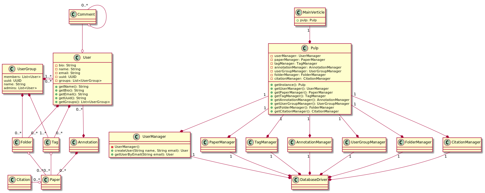
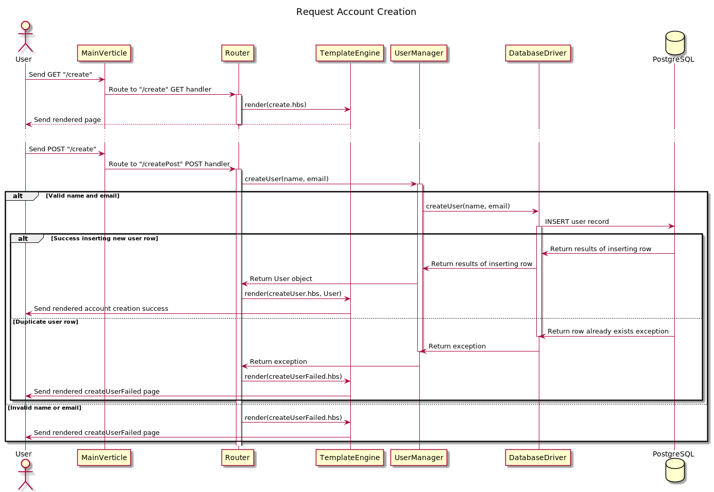
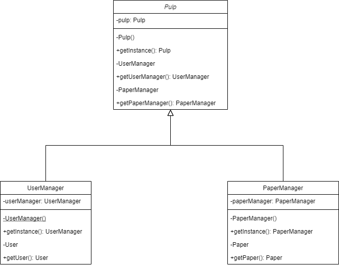
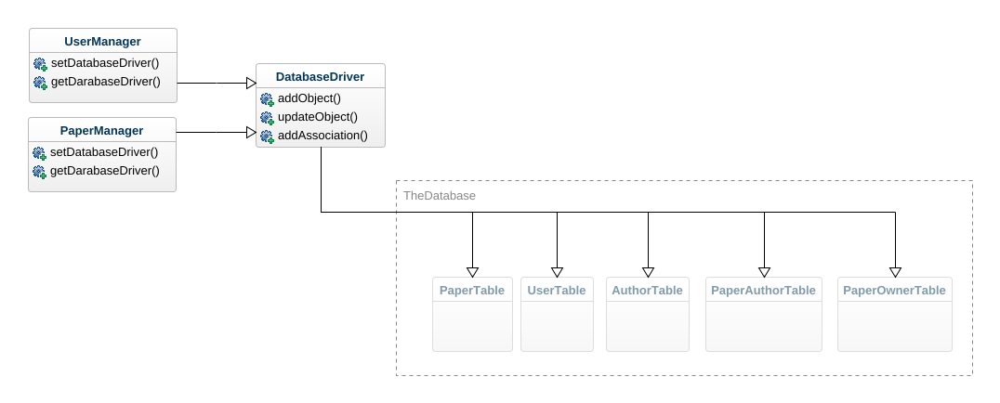

# Project Inception

Group 02 - "Pulp"

Date: 2021-07-23

## 1. Description

Pulp is a website that allows its users to upload, view, and save papers for easy access for your research. There are currently two main features that we have running; users and papers. We have UserManager and PaperManager classes that handle the User and Paper classes and the Pulp class is an instance that handles that manager classes. Through the User class and section of the website you can create an account, login, access your profile, and edit your profile information which currently is just a name, an email, and a bio. On the other hand in paper you can upload, view, and edit a pdf. We also have a database implemented as a facade. Future implementations hope to add tags to the papers so papers can be sorted through.

## 2. Architecture

We use a layered architecture that is effectively MVC for out system, with a web layer that renders our pages
functioning as our view layer, managers that conduct business logic and talk to our database for the controllers, and
the data objects that make up our model in the data layer.

## 3. Class diagram

## 4. Sequence Diagram

Description: A user comes to our web site with the objective of creating an account

Preconditions: The user is on the website.

Postcondions: The user has setup an account.

Main Flow:

1. The user is on our main page
2. The user clicks the create account page
3. The system sends the user the account creation page
4. The user enters their display name and email and clicks the create account button
5. The system takes the user to their account page

Alternate Flow: From 4, the user's account is invalid.

1. The system tells the user that an error occured in their submission and the type of error, and takes them back to the
   account creation page.

## 5. Design Patterns

### 5.1 Singleton

Creational Design Patterns
> Singleton: Ensures only one instance of an object is created.(1)

Pulp:           https://github.com/Csaluski/cs-386-project/blob/main/src/main/java/edu/nau/cs386/Pulp.java

UserManager:    https://github.com/Csaluski/cs-386-project/blob/main/src/main/java/edu/nau/cs386/manager/UserManager.java

UserPaper:      https://github.com/Csaluski/cs-386-project/blob/main/src/main/java/edu/nau/cs386/manager/PaperManager.java

### 5.2 Facade

Structural Design Pattern
> Façade: Provides a simple interface to a more complex underlying object.(1)

DatabaseDriver: https://github.com/Csaluski/cs-386-project/blob/main/src/main/java/edu/nau/cs386/database/DatabaseDriver.java

UserManager:    https://github.com/Csaluski/cs-386-project/blob/main/src/main/java/edu/nau/cs386/manager/UserManager.java

UserPaper:      https://github.com/Csaluski/cs-386-project/blob/main/src/main/java/edu/nau/cs386/manager/PaperManager.java

>(1) Gamma, E., Helm, R., Johnson, R., & Vlissides, J. (2019, May 21). Gang of Four Design Patterns. Spring Framework
Guru. https://springframework.guru/gang-of-four-design-patterns/.
>
## 6. Design Principles

