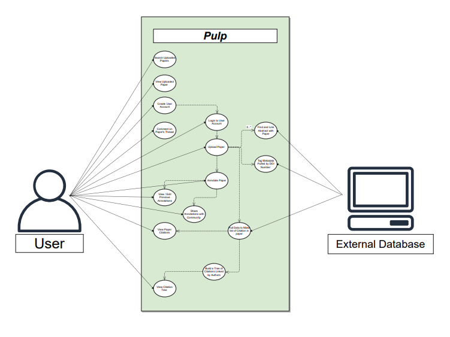
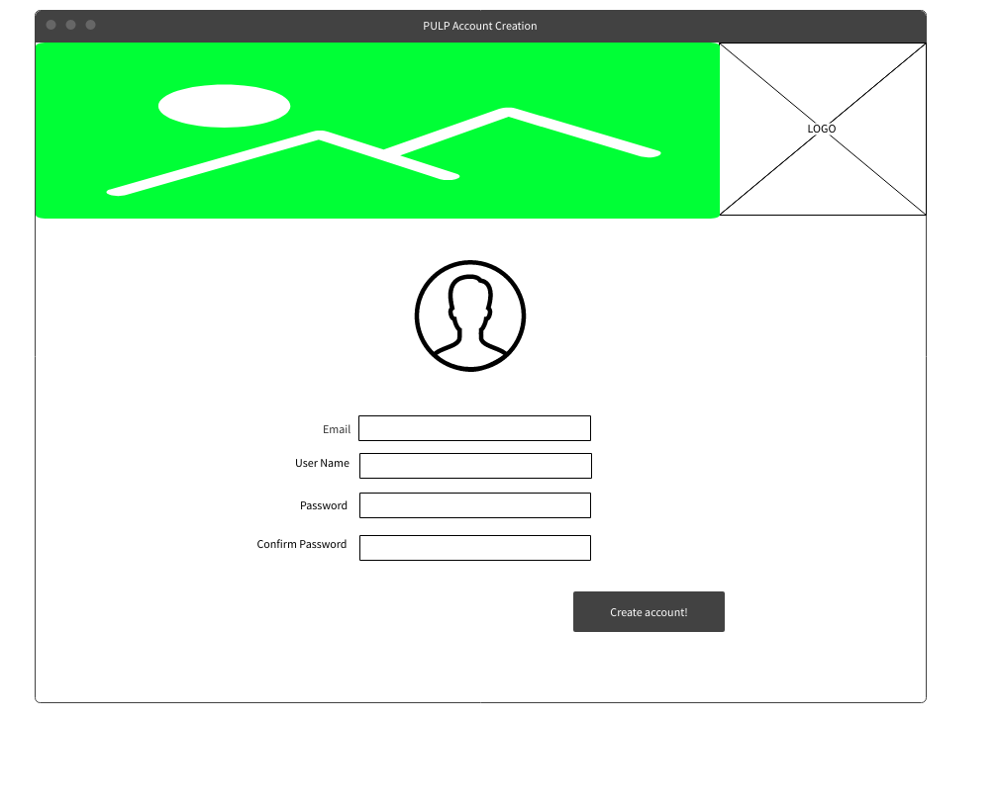
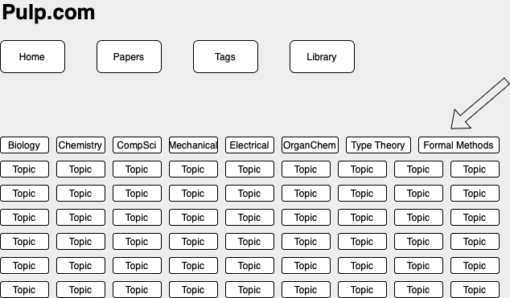
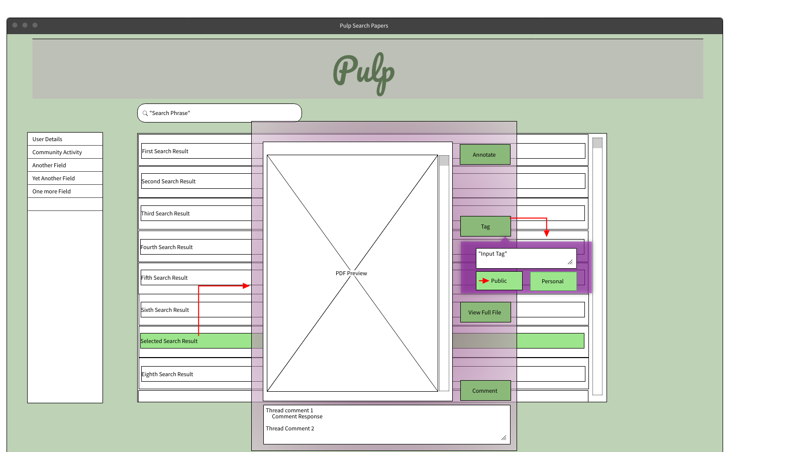
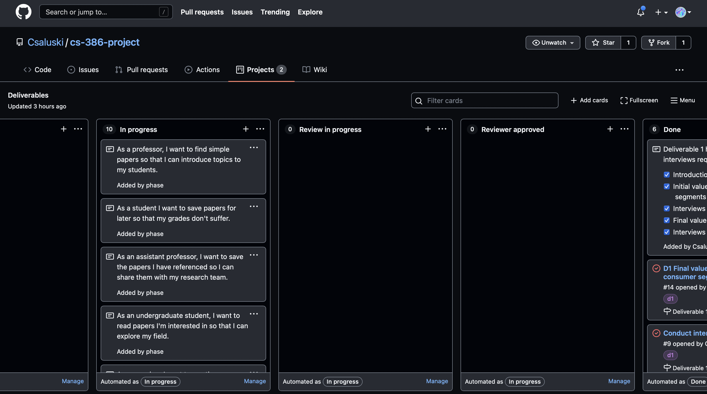

# Requirements
Group 2 - "Pulp"

Date: 2021-07-14

## 1. Postitioning

    1. Problem Statement
   The Problem of organizing research papers affects academics, the impact of which is it taking longer to sort ideas, citations, and the data necessary for performing research and writing papers

    2. Product Position Statement
   For academics who are reviewing and/or referencing academic papers, Pulp is a research paper analysis platform that gives academics the ability to sort and group specific information from several documents; unlike Mendeley, our product utilizes a citation graph and hierarchical tags to enable much faster discovery.

    3.
**Value proposition:** Pulp is a collaboration platform that enables academics to be more effective in their literary research by enabling more effective searching and collaborative annotations.

**Consumer segment:** Academics who have to read many research papers

## 2. Stakeholders
- **Users**:

    * Professors - Read many papers and organize research teams
    * PhD students - Read many papers for comprehensive review
    * Professional Researchers - Help organize research
    * Students - Help organize school work
    * Lab Assistants - Organize the papers for their lab

- **Competitors**:
  * Google Scholar - Paper searching
  * Mendeley - Paper organization
  * ArXiv - Hosts papers, but searching on it is awful.

- **Developers**:
  * Jonathan Boal
  * Jadon Fowler
  * Mina Mimy Naguib Hemaia
  * Christopher Murphy
  * Hannah Larreau
  * Charles Saluski
  * Gemiana

## 3. Functional requirements
1. Search for papers
2. Annotate papers
3. View citation graphs
4. Organize papers with tags
5. View papers
6. Participate in discussions on papers
7. Import citation lists from Mendeley
8. Pull paper abstracts and citations from Google Scholar and university databases
9. Pull full papers from authorized sources

## 4. Non-functional requirements
1. Discoverable interface - Onboarding must be quick to encourage people to move to our platform from their established platforms. We want a user to be able to explore and understand our interface in less than 15 minutes.
2. Fast queries - We want to have reactive searches that update live while typing, so queries must be quick. We want under 100 ms.
3. Fault tolerance - We must not have downtime if our users enter invalid data, or if requests to other online services fail. We will have error handling so that this is handled and the user is informed.
4. Confidentiality - Leaking private user annotations could lead to loss of value to our users. We will not be able to do in depth penetration testing as part of the product development, but we will have user accounts that secure information.

## 5. MVP
- We want to have user accounts, discussion threads, tag based saving, basic searching, and a citation graph in our minimum viable product.
- We will have a minimum implementation of these features with static data, with a live web interface that users can use to fully demo the product.
- We will manually evaluate each feature of the interface, checking that each piece of functionality still works after updates.

## 6. Use cases
### 6.1. Use case diagram

### 6.2. Use case descriptions and interface sketches

**Use case**:
Creating and revising notes

**Actor**:
Researcher
**Description**:
A researcher finalizes and reviews their notes before meeting with their group

**Preconditions**:
Researcher is logged into website and the group also has accounts

**Postconditions**: The information displays annotated

**Main Flow**:
1. Researcher opens the website
2. Researcher pulls up group file share
3. Researcher pulls up the research paper
4. Researcher selects annotate feature
5. Researcher highlights part of the online paper
6. Researcher adds notes about the paper in the side box
7. Researcher saves annotations
8. Researcher shares the document with annotations to peers
9. Researcher comments on the work.

**Alternative Flow**:
1. Researcher opens the website
2. Researcher uploads research paper
3. Researcher annotates the research paper.
4. Researcher shares annotated paper
5. Researcher presents the annotated paper

**Use Case**: Create Account

**Actor**: Researcher

**Description**: A user comes to our web site with the objective of creating an account

**Preconditions**: The user is on the website.

**Postcondions**: The user has setup an account.

**Main Flow**:
1. The user is on our main page
2. The user clicks the create account page
3. The user enters their display name, email, and password
4. The user clicks submit and is sent a confirmation email
5. The user is allowed to use the site before confirming their email, but with limited access

**Alternate Flow**: From 4
1. The user goes to their email and clicks the verification link
2. The user is on the web site and has a fully functional account

**Use case**:
Search for papers in a specific field.

**Actor**:
Researcher

**Description**:
The user searches for papers from a specific field.

**Preconditions**:
The user knows what tag is associated with their field.

**Postconditions**:
The user can see all papers with the given tag for their field.

**Main Flow**:
1. The user goes to the tags page
2. They find a tag associated with their field (such as "Biology" or "Computer Science")
3. They click the tag
4. They are sent to a search page with that tag selected
5. They can see all the papers with that tag

**Alternative Flow**:
1. The user is viewing a paper they like and want to see papers in the same field
2. They click on one of the tags associated with that paper
3. They are sent to a search page with that tag selected
4. They can see all the papers with that tag

**Use case**: Adding a Tag to Paper

**Actor**: Professor

**Description**: A professor wants to add a tag to a paper.

**Preconditions**: The professor has an account, is logged in, and desired paper saved in Pulp.

**Postconditions**: The desired paper had a new tag associated that other users can use to search the paper.

**Main Flow**:
1. In the case the paper was uploaded by professor; professor searches their uploaded papers (title, DOI
   number, author, tag, or manually scrolling through list).
2. Professor selects the desired paper from search results.
3. System opens paper in "view" mode giving the professor choices to annotate, tag, comment on thread, or
   simply scroll through the paper.
4. The professor selects the "tag" option.
5. The system opens a text box and two buttons at the bottom "public" and "personal".
6. The professor inserts text relating to desired identifying tag and selects the "public" button.
7. The system saves tag as a related description to the paper so that the whole community can see the tag.

**Alternative Flow**:
1. In the case the paper was uploaded by a different user; professor searches community papers (title,
   DOI number,author, tag, previously viewed, member uploaded by).
2. Professor selects the desired paper from search results.
3. System opens paper in "view" mode giving the professor choices to annotate, tag, comment on thread, or
   simply scroll through the paper.
4. The professor selects the "tag" option.
5. The system opens a text box and two buttons at the bottom "public" and "personal".
6. The professor inserts text relating to desired identifying tag and selects the "personal" button.
7. The system saves tag as a related description to the paper in the professors personal tags so that the professor can
   use their personal search term to find the paper later.

**Use case**:
Find related papers by following citation graph

**Actor**:
Paper searcher

**Description**:
The user saves new papers relevant to their research by following citations

**Preconditions**: The user has found one paper relevant to their research

**Postconditions**: The user has discovered more relevant papers through this search

**Main Flow**:
1. The user opens a paper they've previously found on Pulp
2. They move to the citation graph page for the paper
3. They see a graph of papers and books cited by their paper, as well as papers and books it cites
4. They mouse over a paper to see the full title, authors, where the paper is from, and abstract
5. When they find a paper of interest they save the paper to read later

**Alternative Flow**: From main flow 2.
1. The user enters a search key word to filter the books and papers
2. They inspect the subset of papers this returns, mousing over articles to view details
3. The user saves papers of interest

## 7. User stories

1. As a head researcher I want to annotate live so that my research group can stay on the same page.

* Priority: Low
* Difficulty: High

2. As a researcher, I want to have a conversion maker so that I can make my measurements uniform faster.

* Priority: High
* Difficulty: Low

3. As a professor, I want a discussion section so that my peers and I can discuss papers easier.

* Priority: High
* Difficulty: Medium

4. As a student I want to save papers for later so that my grades don't suffer.

* Priority: High
* Difficulty: Low

5. As an undergraduate student, I want to read papers I'm interested in so that I can explore my field.

* Priority: High
* Difficulty: Low

6. As a PhD candidate, I want to save section sof each paper I am citing, so I can save time when writing my papers.

* Priority: Low
* Difficulty: High

7. As an assistant professor, I want to save the papers I have referenced, so I can share them with my research team.

* Priority: High
* Difficulty: Low

8. As a professor, I want to find simple papers so that I can introduce topics to my students.

* Priority: Medium
* Difficulty: Medium

9.  As a searcher, I want to see the papers I've saved in an organized manner so that I can quickly find what I am looking for.

* Priority: High
* Difficulty: Low

10. As a paper searcher, I want to explore the citations of this paper and papers that cite it so that I can find more useful papers.

* Priority: Medium
* Difficulty: High

## 8. Issue tracker

We are using the project kanban boards on GitHub instead of Trello

