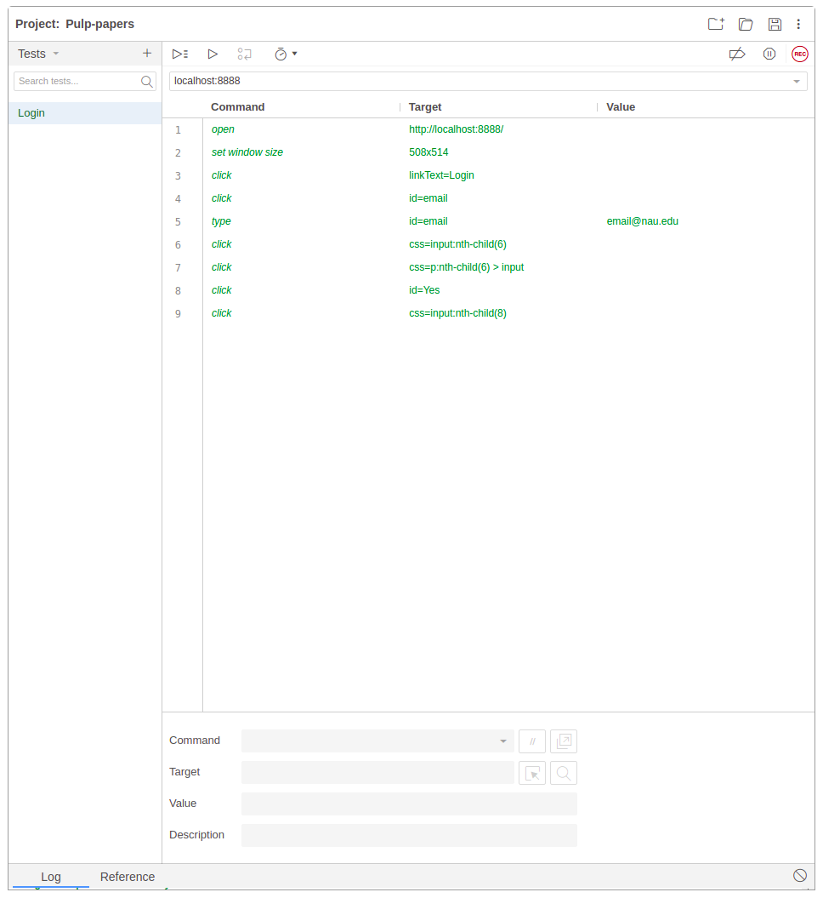

# Verification and Validation

Group 2 - "Pulp"

Date: 2021-07-29

## 1. Introduction

Pulp is a web based platform to assist individuals performing literature research to save time and reduce frustration.
By providing a service to sort their literature searches, Pulp will help researchers keep the important information at
their fingertips instead of having to re-search it.

Pulp is open source at https://github.com/Csaluski/cs-386-project

## 2. Verification

### 2.1 Unit Tests

### 2.2 Integration Tests

### 2.3 Acceptance Tests

1. We used the testing framework Selenium IDE for our tests, as it has a very easy to use GUI editor that enabled us to
   quickly pick up the platform.
2. [Selenium IDE project file.](https://github.com/Csaluski/cs-386-project/blob/b013757afed9fd221841311b5e466fc95bcbeace/src/test/selenium/Pulp-papers.side)
   Unfortunately these are not automated, as we had many issues while trying to set up an automated framework.
3. The actions for the task to test the login begin
   on [line 8](https://github.com/Csaluski/cs-386-project/blob/b013757afed9fd221841311b5e466fc95bcbeace/src/test/selenium/Pulp-papers.side#L8)
   of the previous file. This test logs the user in and out of the application.
4. 

## 3. Validation
