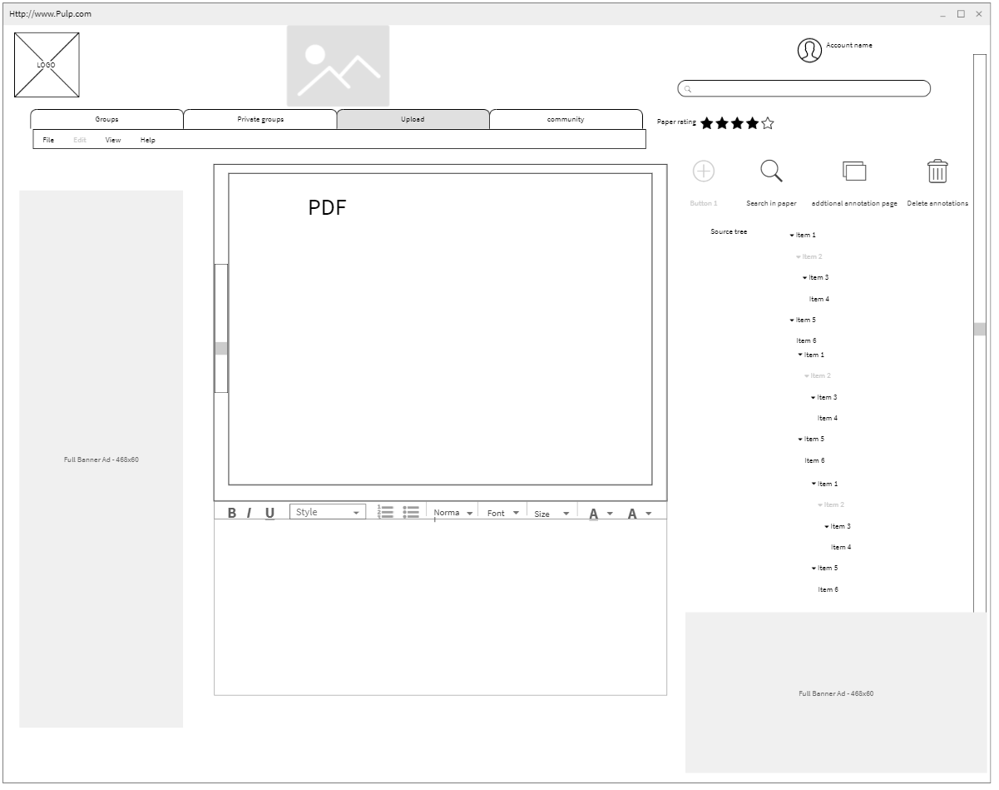

**Use case**:
Jon Boal
**Actor**:
Researcher
**Description**: 
Researcher finalizes notes to group

**Preconditions**: 
Researcher is logged into website and the group also has accounts

**Postconditions**: The information displays annotated 

**Main Flow**:
1. Researcher opens the website
2. Researcher pulls up group file share 
3. Researcher pulls up the research paper
4. Researcher selects annotate feature
5. Researcher highlights part of the online paper
6. Researcher adds notes about the paper in the side box
7. Researcher saves annotations
8. Researcher shares the document with annotations to peers
9. Researcher comments on the work.

**Alternative Flow**:
1. Researcher opens the website
2. Researcher uploads research paper
3. Researcher annotates the research paper. 
4. Researcher shares annotated paper  
5. Researcher presents the annotated paper

