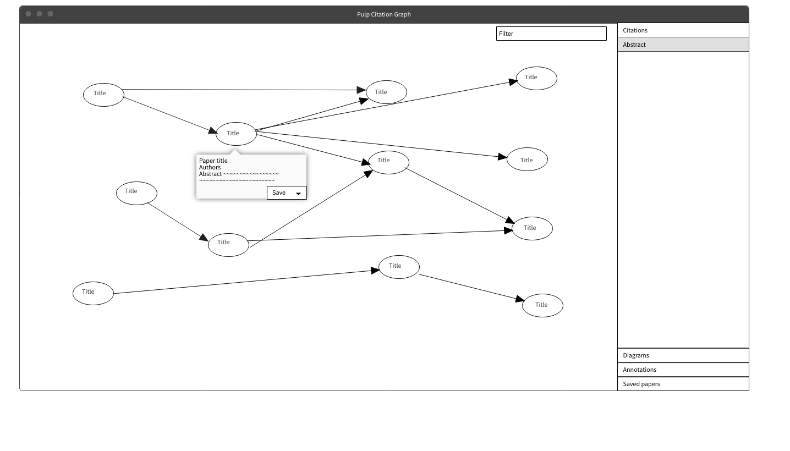

**Use case**:
Find related papers by following citation graph

**Actor**:
Paper searcher

**Description**:
The user saves new papers relevant to their research by following citations

**Preconditions**: The user has found one paper relevant to their research

**Postconditions**: The user has discovered more relevant papers through this search

**Main Flow**:
1. The user opens a paper they've previously found on Pulp
2. They move to the citation graph page for the paper
3. They see a graph of papers and books cited by their paper, as well as papers and books it cites
4. They mouse over a paper to see the full title, authors, where the paper is from, and abstract
5. When they find a paper of interest they save the paper to read later

**Alternative Flow**: From main flow 2.
1. The user enters a search key word to filter the books and papers
2. They inspect the subset of papers this returns, mousing over articles to view details
3. The user saves papers of interest

